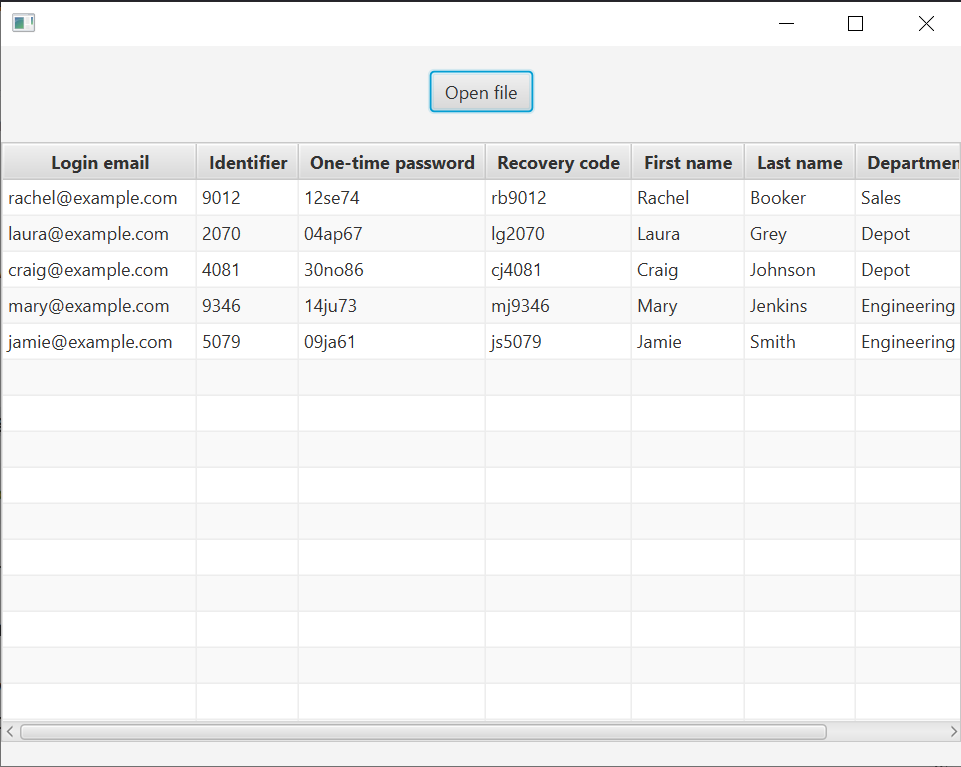

# File Analyzer

[](https://github.com/LimJunxue/file_analyzer/actions/workflows/maven.yml)



## Start the program

You will need Java 11 JDK to run this program. Double click the `file_analyzer-1.0-SNAPSHOT-shaded.jar` file in the `target` folder to start the program. If that doesn't work, you can run the following command in the terminal:

```
java -jar target/file_analyzer-1.0-SNAPSHOT-shaded.jar
```
